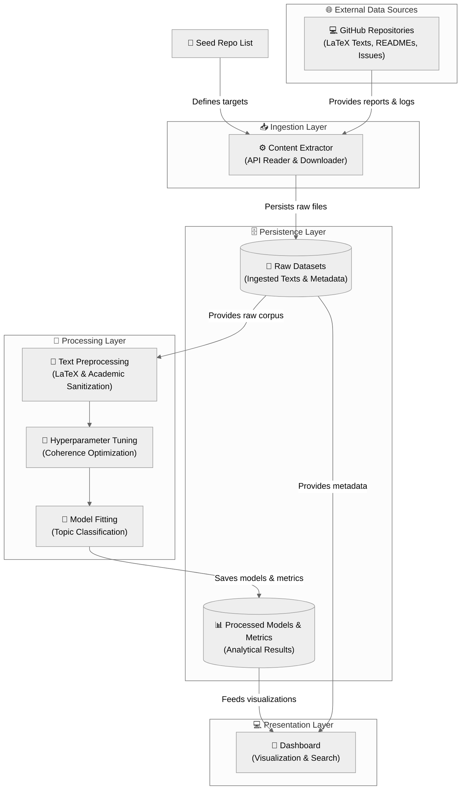

# 🎓 TFG Qualitative Thematic Analysis

[](https://www.python.org/downloads/)
[](https://github.com/zcc1001/tfg-topics/issues)
[](https://github.com/zcc1001/tfg-topics/wiki)
[](https://github.com/zcc1001/tfg-topics/releases)
[](https://zube.io/)
[](https://github.com/zcc1001/tfg-topics/actions)
[](https://sonarcloud.io/summary/new_code?id=zcc1001_tfg-topics)
[](https://sonarcloud.io/summary/new_code?id=zcc1001_tfg-topics)
[](https://sonarcloud.io/summary/new_code?id=zcc1001_tfg-topics)
[](https://www.docker.com/)
[](https://sonarcloud.io/summary/new_code?id=zcc1001_tfg-topics)

## 📜 Description

This project focuses on developing an application for qualitative thematic analysis of the text contained in Final Degree Project (TFG) reports. The goal is to assist both faculty and students in interpreting and searching for information within reports from previous academic years.

The datasets are generated from the textual information of TFG reports available in LaTeX format on GitHub. The project implements and evaluates the performance of multiple topic modeling algorithms.

## ✨ Features

- **Data Ingestion**: Automatically fetches TFG report data from GitHub repositories.
- **Text Preprocessing**: Cleans and prepares the text for analysis.
- **Topic Modeling**: Implements multiple algorithms to identify underlying themes.
- **Hyperparameter Optimization**: Automatically finds the best parameters for each model.
- **Web Interface**: Exposes the results through a simple web interface.

## 🤖 Algorithms

The project explores and compares several topic modeling techniques:

- [**LDA (Latent Dirichlet Allocation)**](https://github.com/lda-project/lda): A classic probabilistic approach for topic modeling.
- [**Top2Vec**](https://github.com/ddangelov/Top2Vec): Leverages joint word and document embeddings to find topics.
- [**BERTopic**](https://github.com/MaartenGr/BERTopic): Uses BERT embeddings and a class-based TF-IDF to create dense clusters.
- [**FASTopic**](https://github.com/bobxwu/FASTopic): A modern and efficient topic modeling approach.

## 🏗️ Core Architecture & Module Breakdown

The codebase is strictly structured around **Hexagonal Architecture** (Ports and Adapters) using a unified `src/` layout. This decouples core domain business rules from external libraries, database engines, web frameworks, and file I/O operations.



### 📂 Directory Structure

- **`/backend-ingestion`**: Collects final degree project files (READMEs, raw latex code, issue logs, and abstracts) from GitHub. Outputs standardized `.parquet` datasets to `/data/ingestion/`.
- **`/backend-processing`**: Core NLP cleaning, automated Optuna hyperparameter optimization. Outputs result tables to `/data/processing/`.
- **`/frontend-web`**: Streamlit-based web dashboard. Displays topic clouds, intertopic coordinates, document-topic assignments, model comparisons, and specialized academic analysis filtered by tutor, year, and grades.
- **`/data`**: Central repository for all intermediate Parquet datasets (ignored by Git, managed dynamically by running pipelines).
- **`/prototypes`**: Jupyter notebooks detailing prototyping steps, experimental tests, and exploratory analysis.
- **`/docs`**: General project documentation.

---

## ⚙️ Installation & Development Environment

### Prerequisites

For standard execution, only **Git** and **Docker** are required.
To set up a local development environment, **Conda** and **Python 3.10** are required.

### A. Quick Start using Docker (No Python Environment Needed)

By default, the project is configured to run in `release` mode, which pulls pre-built Docker containers from the GitHub Container Registry. You can run the entire pipeline with a single command:

```bash
# 1. Clone the repository
git clone https://github.com/zcc1001/tfg-topics
cd tfg-topics

# 2. Ingest, process, and start the Streamlit web dashboard in one go!
make pipeline
```

---

### B. Standard Local Development Setup

Follow these steps to configure a local Python environment for codebase modifications:

1. **Activate the Conda Environment**:

   ```shell
   # From the project root directory
   conda env create -f environment.yml
   conda activate tfg-topics
   ```

2. **Install Development & QA Tools**:

   ```shell
   pip install black isort flake8 mypy pre-commit
   pre-commit install
   ```

3. **Install Dependencies per Module**:

   ```shell
   # 1. Ingestion requirements
   pip install -r backend-ingestion/requirements.txt -r backend-ingestion/requirements-dev.txt

   # 2. Processing requirements
   pip install -r backend-processing/requirements.txt -r backend-processing/requirements-dev.txt

   # 3. Frontend Web requirements
   pip install -r frontend-web/requirement.txt
   ```

---

### C. GitHub Codespaces

The project includes a comprehensive `.devcontainer` configuration. When launching a Codespace, it automatically provisions a Python 3.10 environment, configures the `PYTHONPATH` for all modular projects, and installs all module requirements and developer tools out-of-the-box.

---

## 🛠️ Unified Makefile Commands

The root directory contains a `Makefile` that acts as the single developer control center. It supports three execution modes specified via `MODE`:

- `MODE=release` (Default): Uses lightweight, pre-built Docker images.
- `MODE=docker`: Builds and executes Docker containers from local source code.
- `MODE=local`: Executes scripts using your active local Python env.

### Makefile Targets Grid

| Target Command | Execution Mode | Scope & Purpose | Customization Example |
| :--- | :--- | :--- | :--- |
| `make help` | Standard | Lists all Makefile targets, options, and descriptions. | `make help` |
| `make start` | Release / Docker / Local | Launches the Streamlit dashboard on port `8501`. | `make start MODE=local` |
| `make ingest-all` | Release / Docker / Local | Ingests all project categories from the CSV list. | `make ingest-all MODE=local` |
| `make process-all` | Release / Docker / Local | Trains and saves all combinations of 4 models and 4 datasets. | `make process-all MODE=docker` |
| `make pipeline` | Release / Docker / Local | Runs `ingest-all`, `process-all`, and `start` sequentially. | `make pipeline MODE=local` |
| `make pull` | Release | Pulls the latest pre-built container images from registry. | `make pull` |
| `make docker-build` | Docker | Rebuilds all local Docker container images. | `make docker-build` |

### Environment Customization Variables

- `INGEST`: Choose specific ingestion target (`all`, `issues`, `readmes`, `thesis`, `abstracts`).

- `MODELS`: Space-separated list of model algorithms (`lda`, `bertopic`, `top2vec`, `fastopic`).
- `DATASETS`: Space-separated list of datasets to process (`readmes`, `issues`, `thesis`, `abstracts`).

**Example of Custom Local Processing Run**:

```bash
make processing MODELS="lda bertopic" DATASETS="thesis readmes" MODE=local
```

---

## 📄 Seed List Input Schema (`tfg_list.csv`)

The ingestion pipeline retrieves repositories listed in a CSV index file. By default, it expects a file named `tfg_list.csv` inside your designated `[DATA_DIR]/ingestion/` directory (or defined via `REPOS_CSV_FILE_NAME`).

This seed file **must contain all 7 headers** in its first line (in any order). Rows only require `repository_url` to have a valid value; other metadata blocks can remain empty:

| Column | Value Required | Description |
| :--- | :--- | :--- |
| `title` | No | Academic title of the final degree project. |
| `tutors` | No | Supervisor or tutors of the project (supports multiple names)(anonymized). |
| `students` | No | Authoring student(s)(anonymized). |
| `assignment_date` | No | Date when the project was assigned (Format: `DD/MM/YYYY`). |
| `presentation_date` | No | Date when the project was defended (Format: `DD/MM/YYYY`). |
| `grade` | No | Grade score obtained (supports dot/comma decimal separators). |
| `repository_url` | **Yes** | GitHub project URL (SSH or HTTPS format). |

---

## 🚀 Running Frontend Directly from Release Assets

If you only want to visualize results without running ingestion/processing pipelines or installing code:

1. Create a new directory on your local machine.
2. Download both `example-data.zip` and `docker-compose.release.yml` from the [Latest Releases Page](https://github.com/zcc1001/tfg-topics/releases).
3. Unzip `example-data.zip` inside the directory (it will generate a `data/` folder).
4. Run:

   ```bash
   docker compose -f docker-compose.release.yml --profile frontend run --rm --service-ports frontend
   ```

5. Navigate to `http://localhost:8501` to explore topic allocations, PCA intertopic representations, and coherence statistics.
