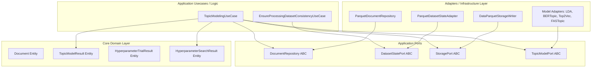

# 🧠 Backend Processing Module

The **Backend Processing Module** is the core analytical engine of the `tfg-topics` repository. It consumes the standardized final degree project (TFG) datasets ingested from GitHub, applies specialized NLP text preprocessing (such as LaTeX sanitization and domain-specific stopword removal), and executes state-of-the-art topic modeling pipelines. To guarantee the highest quality of topic separation, it features an automated hyperparameter search powered by **Optuna**.

---

## 🚀 Key Features

*   **State-of-the-Art Topic Modeling**: Out-of-the-box support for four powerful topic modeling algorithms:
    *   `LDA (Latent Dirichlet Allocation)` (Generative probabilistic model via `gensim`)
    *   `BERTopic` (Neural topic modeling leveraging sentence transformers)
    *   `Top2Vec` (Joint semantic embedding space of documents and words)
    *   `FASTopic` (Fast, optimal transport-based neural topic model)
*   **Specialized Preprocessing**: Academic and technical document cleaning using `LatexTextProcessor` to filter mathematical expressions, tags, and environments.
*   **Multi-Layer Stopwords**: Combines English & Spanish dictionaries with custom LaTeX tokens and domain-specific stopwords (e.g., typical academic phrases).
*   **Optuna-Driven Hyperparameter Optimization**: Automated optimization search trials to maximize topic coherence metric ($C_v$).
*   **Parquet Data Engine**: Clean input and output pipelines built strictly on **Apache Parquet** format.
*   **Robust Consistency & State Tracking**: Ensures processing runs stay synchronized with data changes using dataset hash-based cache validation.

---

## 🏗️ Hexagonal Architecture Layout

This module strictly adheres to **Hexagonal Architecture** (Ports and Adapters) principles using a modern `src/` layout.



### Directory Structure

```text
backend-processing/
├── src/
│   └── processing/
│       ├── domain/
│       │   └── entities.py                   # Pure business entities (Document, TopicModelResult, etc.)
│       ├── application/
│       │   ├── ports/                        # Port definitions (Storage, Repository, TopicModel interfaces)
│       │   ├── services/                     # LaTeX cleanup, hyperparam search coordination, stopwords
│       │   └── usecases/                     # Modeling orchestrations and pipeline workflows
│       ├── infrastructure/
│       │   └── adapters/                     # Parquet readers/writers, modeling adapters implementations
│       ├── main.py                           # CLI Entrypoint script
│       └── logging_config.py                 # Core log format & destination configurations
├── tests/                                    # Exhaustive pytest suites (63 tests)
├── Dockerfile                                # Multi-stage Docker integration
├── requirements.txt                          # Main production dependencies
└── requirements-dev.txt                      # Development & QA tools
```

---

## ⚙️ Installation & Environment

### Local Setup
Ensure you are using **Python 3.10** (strict project restriction). 

Using the project **Conda** environment:
```bash
# Create and activate conda env (from the project root directory)
conda env create -f environment.yml
conda activate tfg-topics

# Install processing requirements
cd backend-processing
pip install -r requirements.txt -r requirements-dev.txt
```

### GitHub Codespaces
The repository contains a preconfigured `.devcontainer` that automatically initializes Python 3.10, configures the `PYTHONPATH` variable for the `src/` layout, and installs the required packages upon start.

---

## 🖥️ Command Line Interface (CLI)

The primary entry point is `src/processing/main.py`.

### Arguments
*   `--model` (Required): Topic modeling algorithm to use. Choices: `lda`, `bertopic`, `top2vec`, `fastopic`.
*   `--dataset` (Required): Input corpus to model. Choices: `readmes`, `issues`, `thesis`, `abstracts`.

### Local Execution Examples
Make sure you run the commands with correct `PYTHONPATH` pointing to the `src` folder.

```bash
# From within backend-processing/
PYTHONPATH=src python src/processing/main.py --model bertopic --dataset readmes

# Run LDA model on final thesis reports
PYTHONPATH=src python src/processing/main.py --model lda --dataset thesis
```

---

## 🛠️ Root Makefile Integration

The main project repository root contains a robust `Makefile` which automates execution using either the **local Python environment**, **locally built Docker containers**, or **pre-built release containers**.

> [!TIP]
> This is the recommended way to execute pipelines as it handles multi-model/multi-dataset batch processing out-of-the-box.

### Batch Processing Examples
Run commands from the **project root directory**:

```bash
# Run a specific model on a specific dataset locally
make processing MODELS="bertopic" DATASETS="readmes" MODE=local

# Run multiple models on multiple datasets via locally built Docker containers
make processing MODELS="lda bertopic" DATASETS="readmes thesis" MODE=docker

# Process ALL combinations (4 models x 4 datasets) using pre-built release Docker images
make process-all
```

---

## 📊 Output Parquet Data Schema

All output files are saved under the directory tree: `[DATA_DIR]/processing/[model_name]/`.
By default, `[DATA_DIR]` points to `/data/` in the project root but can be overridden with the `DATA_DIR` environment variable.

### 1. Hyperparameter Optuna Optimization Results

#### 📄 `[dataset]_hyperparameter_trials.parquet`
Records the outcome of each individual hyperparameter trial run by Optuna (5 trials by default).

| Column | Type | Description |
| :--- | :--- | :--- |
| `trial_id` | `int64` | Progressive index number of the Optuna trial. |
| `model` | `string` | Name of the modeled topic algorithm. |
| `score` | `double` | Optimization score achieved (coherence $C_v$). |
| `state` | `string` | Resulting status of the trial (`COMPLETE`, `FAIL`, etc.). |
| `...params` | `dynamic` | Separate columns dynamically created for each tuned hyperparameter. |

#### 📄 `[dataset]_best_hyperparameters.parquet`
Stores the single best set of hyperparameters determined by the optimization step.

| Column | Type | Description |
| :--- | :--- | :--- |
| `dataset` | `string` | Name of the corpus analyzed. |
| `model` | `string` | Name of the topic model algorithm. |
| `best_score` | `double` | Highest coherence score achieved across trials. |
| `...params` | `dynamic` | Separate columns dynamically created for each tuned hyperparameter. |

---

### 2. Topic Modeling Result Datasets
All of the following output files are stamped with a unique `run_id` allowing precise analysis grouping.

#### 📄 `[dataset]_model_summary.parquet`
High-level summary of the training run metadata.

| Column | Type | Description |
| :--- | :--- | :--- |
| `dataset` | `string` | Corpus analyzed (e.g., `readmes`). |
| `model_name` | `string` | Algorithm name (lowercase). |
| `run_id` | `string` | Unique UUID generated for the execution run. |
| `dataset_hash` | `string` | SHA-256 hash of the input dataset for consistency validation. |
| `coherence` | `double` | Final coherence metric value ($C_v$). Can be `null` if calculation fails. |
| `num_topics` | `int64` | Total number of successfully extracted topics. |
| `runtime_seconds` | `double` | Total training execution duration in seconds. |
| `created_at` | `timestamp` | Exact UTC timestamp of output generation. |

#### 📄 `[dataset]_topics.parquet`
Stores the top ranking words constituting each extracted topic.

| Column | Type | Description |
| :--- | :--- | :--- |
| `dataset` | `string` | Corpus analyzed. |
| `model_name` | `string` | Algorithm name (lowercase). |
| `run_id` | `string` | Unique UUID generated for the execution run. |
| `topic_id` | `int64` | Numeric identifier of the topic. |
| `word` | `string` | The vocabulary term. |
| `rank` | `int64` | Importance rank of the word within the topic (1 to 10). |

#### 📄 `[dataset]_document_topics.parquet`
Maps individual documents to their constituent topics with corresponding probabilities.

| Column | Type | Description |
| :--- | :--- | :--- |
| `document_id` | `int64` / `string` | Identifier matching the row index of the source ingestion dataset. |
| `topic_id` | `int64` | Numeric identifier of the topic. |
| `probability` | `double` | Probability weight/membership score of the document in the topic. |
| `dataset` | `string` | Corpus analyzed. |
| `model_name` | `string` | Algorithm name. |
| `run_id` | `string` | Unique UUID generated for the execution run. |

#### 📄 `[dataset]_metrics.parquet`
Detailed list of calculated evaluation metrics.

| Column | Type | Description |
| :--- | :--- | :--- |
| `dataset` | `string` | Corpus analyzed. |
| `model_name` | `string` | Algorithm name. |
| `run_id` | `string` | Unique UUID generated for the execution run. |
| `metric` | `string` | Name of the calculated metric (e.g. `coherence`). |
| `value` | `double` | Metric score. |

#### 📄 `[dataset]_params.parquet`
The final parameters used to fit the model.

| Column | Type | Description |
| :--- | :--- | :--- |
| `dataset` | `string` | Corpus analyzed. |
| `model_name` | `string` | Algorithm name. |
| `run_id` | `string` | Unique UUID generated for the execution run. |
| `param` | `string` | Parameter parameter key. |
| `value` | `string` | Parameter value serialized to string format. |

#### 📄 `[dataset]_topic_coordinates.parquet`
2D PCA dimensional reduction coordinates for visual representations.

| Column | Type | Description |
| :--- | :--- | :--- |
| `topic_id` | `int64` | Numeric identifier of the topic. |
| `x` | `double` | Coordinate position on the X-axis (from PCA projection). |
| `y` | `double` | Coordinate position on the Y-axis (from PCA projection). |
| `size` | `double` | Count/frequency representing topic popularity. |
| `dataset` | `string` | Corpus analyzed. |
| `model_name` | `string` | Algorithm name. |
| `run_id` | `string` | Unique UUID generated for the execution run. |

---

## 🧪 Testing

The processing module has comprehensive test suites validating text cleaning pipelines, adapters, use cases, and configuration files.

To run the unit and integration tests under the active conda environment:
```bash
# Execute within the backend-processing directory
conda run -n tfg-topics pytest
```

---

## 🐳 Docker Deployment

To build and run the processing module inside an isolated container from the project root directory:

```bash
# Build the Docker image
docker compose --profile processing build

# Execute a run container (e.g. BERTopic on READMEs)
docker compose --profile processing run --rm processing --model bertopic --dataset readmes
```

